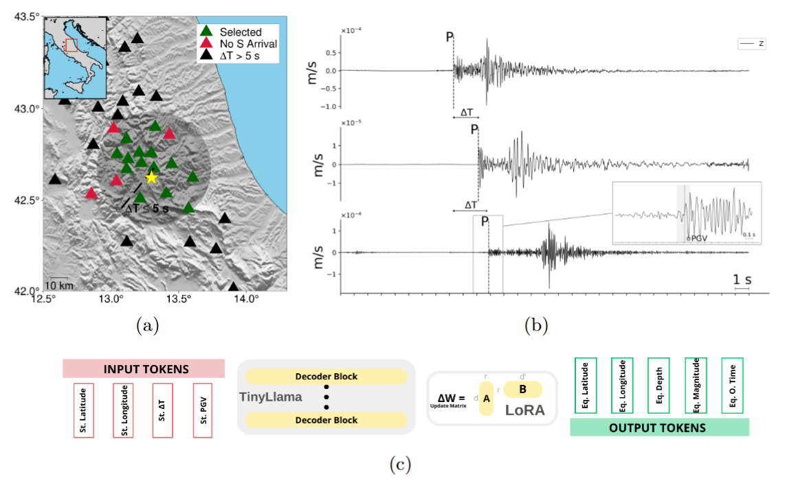

# Rapid Estimation of Earthquake Magnitude and Location Using a Large Language Model

Project Page | Paper Link

Authors: [Aurora Bassani](https://scholar.google.com/citations?user=CWKSGO8AAAAJ&hl=it&authuser=3&oi=ao), [Daniele Trappolini](https://daniele-trappolini.github.io/), Giulio Poggiali, [Elisa Tinti](https://scholar.google.com/citations?user=DN02TWEAAAAJ&hl=it&oi=ao), [Fabio Galasso](https://scholar.google.com/citations?user=2gSuGBEAAAAJ&hl=it&oi=ao), [Chris Marone](https://scholar.google.com/citations?user=dQnMIVcAAAAJ&hl=it&oi=ao), [Alberto Michelini](https://scholar.google.com/citations?user=y3vfoJ0AAAAJ&hl=it&oi=ao)

## Overview
This repository contains the implementation and supporting materials for the research paper titled "Rapid Estimation of Earthquake Magnitude and Location Using a Large Language Model" by Aurora Bassani et al. The study introduces a novel model leveraging Large Language Models (LLMs) for enhancing earthquake early warning systems by providing rapid estimates of earthquake magnitude and location.



## Installation
Instructions to set up the environment and install necessary libraries.

```pip install -r requirements.txt```

## Usage

**`prepocessing.py`**
This script is responsible for preprocessing the dataset used for training the model. It handles tasks such as:
- Reading and cleaning instance metadata.
- Computing Peak Ground Velocity (PGV) for both P and S waves.
- Selecting data based on ground motion units and trace distances.
- Generating input and output pairs for training by formatting the data as required by the model.

**`train_val_test.py`**
This script divides the dataset into training, validation, and testing sets. It ensures that the data is split according to the magnitude of the events to maintain a balanced representation across different magnitudes in each set.

**`finetuning_P.py`** and **`finetuning_S.py`**
These scripts fine-tune the pre-trained Large Language Model (TinyLlama) for specific tasks:
- `finetuning_P.py` focuses on fine-tuning the model using data related to P-waves.
- `finetuning_S.py` is used for fine-tuning the model on data associated with S-waves.
Both scripts handle data loading, model configuration, setting up training arguments, and initiating the training process.

**`predictions_P.py`** and **`predictions_S.py`**
These scripts generate predictions for the test set from the fine-tuned models:
- `predictions_P.py` loads the model fine-tuned on P-wave data and predicts outputs for the test set.
- `predictions_S.py` does the same for the S-wave model.
Each script formats the input data, runs the model, and saves the predictions for further evaluation.

**`evaluation.py`**
This script evaluates the predictions made by the models. It calculates various metrics such as:
- Epicentral and hypocentral distances.
- Differences in predicted and true magnitudes and depths.
- Statistical summaries of performance across different magnitude ranges.
The script uses geodetic functions to compute distances and outputs evaluation metrics that help in assessing the model's performance.

Each of these scripts plays a crucial role in the workflow of the project, from data preparation and model training to prediction and evaluation. Ensure you have the necessary dependencies installed and follow the specific instructions for each script to replicate the results.

## Citation
If you find this research useful, please consider citing:

```bibtex
@article{llm4geo_2025,
  title={Rapid Estimation of Earthquake Magnitude and Location Using a Large Language Model},
  author={Bassani, Aurora et al.},
  journal={Non-peer reviewed Research Article submitted to NATURE COMMUNICATIONS},
  year={2025}
}
```

## Contributions and Support

- Contributions to this project are welcome. Please send pull requests or open issues for bugs or feature requests.
- For support, contact **Aurora Bassani** at *aurora.bassani@uniroma1.it*
